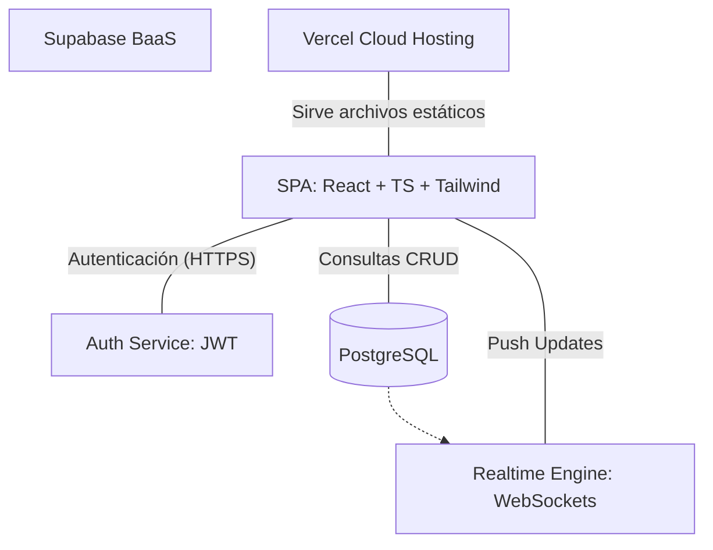
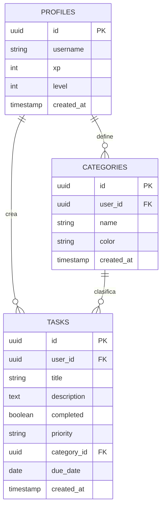

# INFORME TÉCNICO: Proyecto TaskFlow
## Sistema de Gestión de Tareas con Gamificación y Tiempo Real

---

**Asignatura:** Desarrollo de Aplicaciones Web  
**Alumno:** Jonathan  
**Fecha:** Marzo 2026

---

## 1. Introducción
**TaskFlow** es una solución integral para la gestión de la productividad personal. A diferencia de las aplicaciones de listas tradicionales, TaskFlow integra elementos de **gamificación** (XP y Niveles) para incentivar la finalización de tareas y utiliza una arquitectura **serverless** para garantizar la disponibilidad y sincronización en tiempo real entre múltiples dispositivos.

## 2. Diagrama de Arquitectura del Sistema

La aplicación sigue un modelo de **Arquitectura de Microservicios Backend-as-a-Service (BaaS)**:



### Componentes:
*   **Frontend:** Desarrollado con Vite, React 18 y TypeScript. Utiliza Tailwind CSS v4 para una interfaz de usuario fluida y oscura.
*   **Base de Datos:** PostgreSQL hospedado en Supabase, con seguridad a nivel de fila (RLS).
*   **Sincronización:** Supabase Realtime para actualizaciones sin recargar la página.

## 3. Modelo de Datos (Diagrama ERD)

El sistema se basa en tres entidades principales relacionadas:



## 4. Funcionalidades Principales

1.  **Dashboard de Estadísticas:** Visualización de KPIs (Indicadores Clave de Desempeño) mediante gráficas de `recharts`.
2.  **Sistema de Gamificación:**
    *   **XP (Puntos de Experiencia):** Se otorgan 10 XP por cada tarea completada.
    *   **Niveles:** El usuario sube de nivel cada 100 XP recolectados.
    *   **Insignias (Badges):** Desbloqueo automático de logros (Primer paso, Maestro, etc.).
3.  **Gestión de Categorías:** Personalización de etiquetas con colores específicos (Trabajo, Personal, Estudio, etc.).
4.  **Filtros Avanzados:** Búsqueda reactiva por texto, prioridad y estado (pendiente/completada).

## 5. Seguridad y Privacidad (RLS)
Se implementaron políticas de **Row Level Security (RLS)** en PostgreSQL para asegurar que los datos estén aislados por usuario:

```sql
-- Ejemplo de política para Tareas
CREATE POLICY "Users can only see their own tasks" ON tasks
    FOR ALL USING (auth.uid() = user_id);
```

## 6. Manual de Usuario Rápido

1.  **Registro:** Crear cuenta con correo electrónico. (Supabase gestiona el hash de contraseñas de forma segura).
2.  **Dashboard:** Al entrar, se visualiza el progreso actual y las estadísticas del historial.
3.  **Tareas:** En la pestaña "Tareas", usar el botón "+" para añadir actividades. Se pueden definir prioridades (Alta/Media/Baja).
4.  **Categorías:** En la pestaña "Categorías", el usuario puede crear sus propios grupos de trabajo con colores personalizados.

## 7. Conclusiones y Trabajo Futuro

El proyecto demuestra la viabilidad de utilizar tecnologías de "Cero Configuración" de Servidor (Serverless) para crear herramientas de alta escala y bajo costo. Como trabajo futuro, se planea integrar notificaciones Push móviles y calendarios externos (Google Calendar).

## 8. Bibliografía
*   *React Documentation (2024).* "State and Lifecycle".
*   *Supabase Docs.* "PostgreSQL Realtime and RLS Policies".
*   *Tailwind CSS v4.* "Design systems and utility classes".
