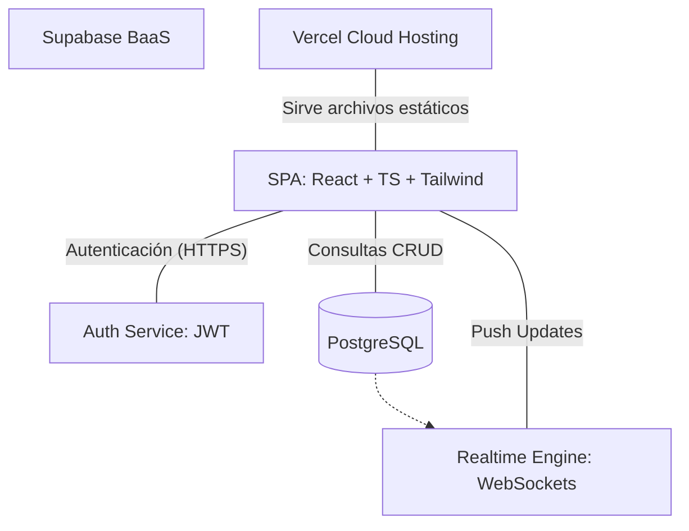

# INFORME TÉCNICO: Proyecto TaskFlow
## Sistema de Gestión de Tareas con Gamificación y Tiempo Real

---

**Asignatura:** Desarrollo de Aplicaciones Web  
**Alumno:** Jonathan  
**Fecha:** Marzo 2026

---

## 1. Introducción
**TaskFlow** es una solución integral para la gestión de la productividad personal. A diferencia de las aplicaciones de listas tradicionales, TaskFlow integra elementos de **gamificación** (XP y Niveles) para incentivar la finalización de tareas y utiliza una arquitectura **serverless** para garantizar la disponibilidad y sincronización en tiempo real entre múltiples dispositivos.

## 2. Historial de Versiones (Changelog)

A continuación, se detalla el registro de versiones y los avances realizados en cada etapa del desarrollo:

| Versión | Fecha | Descripción de Cambios |
|---|---|---|
| **v0.1** | 24/02/2026 | Inicialización del proyecto con Vite + React y configuración de Tailwind CSS. |
| **v1.0** | 25/02/2026 | Implementación del sistema de Autenticación (Login/Register) y CRUD básico de tareas conectado a Supabase. |
| **v1.1** | 26/02/2026 | Adición de Dashboard dinámico, sistema de Gamificación (XP/Levels) y gestión de categorías con colores. |
| **v1.2** | 27/02/2026 | Corrección de errores de sintaxis TypeScript, configuración de despliegue en Vercel y optimización de archivos (chunks). |
| **v1.3** | 02/03/2026 | Refinamiento de documentación final, manual de usuario y reporte de contratiempos. |

## 3. Contratiempos Técnicos Superados

Durante el desarrollo del proyecto se presentaron diversos contratiempos que fueron resueltos mediante investigación y pruebas técnicas:

*   **Contratiempo en Verificación de Correo (Gmail):** Al registrar nuevas cuentas, el sistema de Supabase enviaba un correo de confirmación con un link que los usuarios a veces no recibían o no procesaban. Esto causaba errores de "Credenciales Incorrectas" al intentar iniciar sesión.
    *   *Solución:* Se desactivó la confirmación obligatoria de correo en la configuración de Auth de Supabase para permitir un acceso inmediato.
*   **Contratiempo en Variables de Entorno (Vercel):** La aplicación mostraba una pantalla negra al desplegarse en producción debido a que las llaves de Supabase no se cargaban correctamente desde el sistema de Vercel.
    *   *Solución:* Se ajustó el cliente de Supabase para manejar valores por defecto y se realizaron redeploys manuales para asegurar la inyección de secretos.
*   **Contratiempo en Esquema de Base de Datos:** Existieron pequeñas inconsistencias iniciales al ejecutar el SQL, lo que impedía que las tablas de "profiles" y "tasks" se comunicaran correctamente por permisos de RLS.
    *   *Solución:* Se refinaron las políticas de seguridad (Row Level Security) para permitir que cada usuario solo acceda a su información de forma aislada.
*   **Contratiempo en Sincronización Realtime:** La actualización automática no siempre se reflejaba en el Dashboard de forma inmediata.
    *   *Solución:* Se optimizaron los canales de comunicación de Supabase para escuchar específicamente los eventos de la cuenta activa.

## 4. Arquitectura y Modelo de Datos

La aplicación sigue un modelo de **Arquitectura de Microservicios Backend-as-a-Service (BaaS)** impulsado por PostgreSQL:

## 5. Manual de Usuario Rápido

1.  **Registro:** Crear una cuenta en la pantalla de "Crear Cuenta".
2.  **Dashboard:** Visualización del nivel de XP actual y gráficas de actividad.
3.  **Tareas:** Añadir actividades con prioridades (Alta, Media, Baja) y categorías. Completar una tarea otorga +10 XP.
4.  **Categorías:** Personalización de etiquetas para organizar el trabajo.

## 6. Conclusiones

El desarrollo de TaskFlow permitió integrar tecnologías modernas de desarrollo web, demostrando que es posible crear aplicaciones robustas y escalables con una arquitectura orientada a la nube. El uso de TypeScript garantizó un código más estable y fácil de mantener frente a los contratiempos encontrados.
